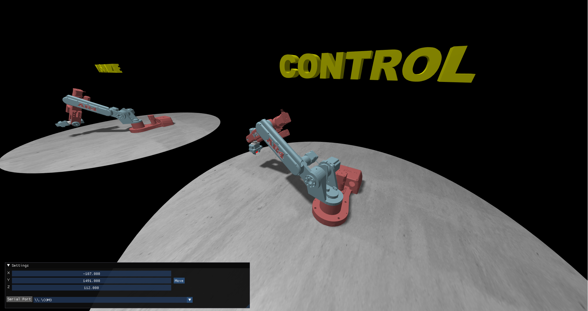

# Robot Palletizer Tycoon & Chris Annin Robot Arm Visualization

This repository houses two distinct yet interconnected components:

1. **Robot Palletizer Tycoon**: A real-time strategy game centered around managing a factory of robot arms.
2. **Chris Annin Robot Arm Visualization**: A real-time visualization tool for Chris Annin Robot Arms.

## Robot Palletizer Tycoon

Immerse yourself into the role of a factory manager in Robot Palletizer Tycoon. Your responsibility is to ensure a seamless process of picking up products from a conveyor belt with robot arms and stacking the boxes on pallets.

### Game Features

- **Factory Expansion**: Start with an empty warehouse and transform it into a bustling factory.
- **Upgrades**: Increase your efficiency by upgrading your robot arms, conveyor belts, and box spawn rates.
- **Rewards**: Earn money rewards every time a pallet is fully stacked.

## Chris Annin Robot Arm Visualization

This project also includes a standalone visualization tool for Chris Annin Robot Arms. Connect to the robot via serial USB and visualize the robot's movement in real-time.

### Visualization Features

- **Real-Time Visualization**: Connect to the robot via serial USB to see the robot movements in real-time.
- **Live Control**: Send data to the robot and control its movement in real-time.

## Getting Started

### Requirements

- Windows 10 for robot control (optional)
- Serial USB connection for robot control (optional)

## License

This project is licensed under the MIT License. See the [LICENSE](LICENSE) file for details.