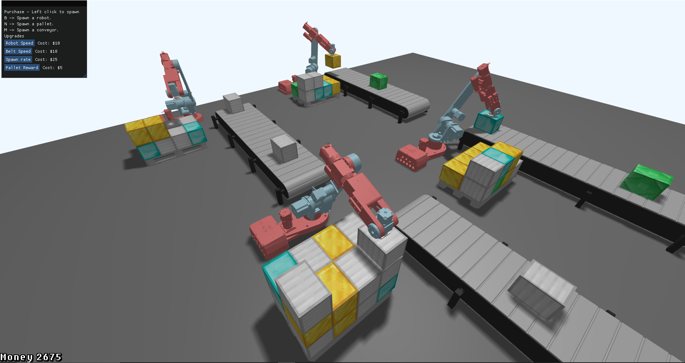
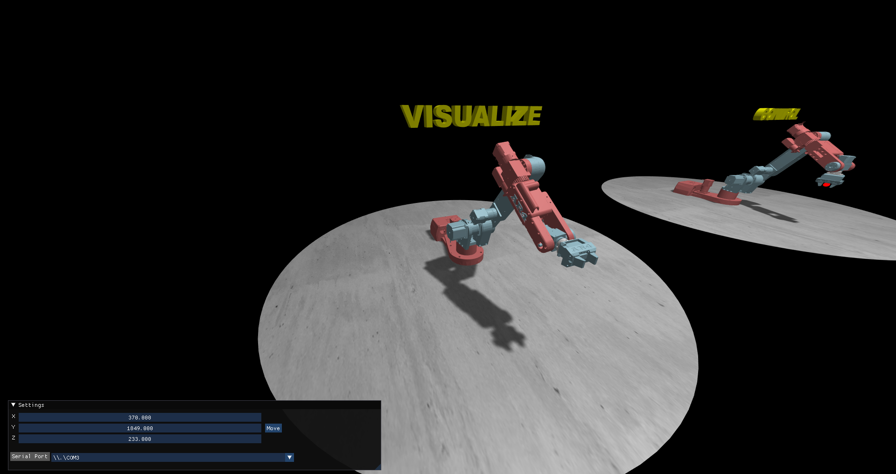

# Robot Palletizer Tycoon & Chris Annin Robot Arm Visualization

This repository houses two distinct yet interconnected components:

1. **Robot Palletizer Tycoon**: A real-time strategy game centered around managing a factory of robot arms.
2. **Robot Arm Visualization**: A real-time visualization tool for Annin Robotics Robot Arms.

## Robot Palletizer Tycoon

Immerse yourself into the role of a factory manager in Robot Palletizer Tycoon. 
Your responsibility is to ensure a seamless process of picking up 
products from a conveyor belt with robot arms and stacking the boxes on pallets.

### Game Features

- **Factory Expansion**: Start with an empty floor and transform it into a large factory.
- **Upgrades**: Increase your efficiency by upgrading your robot arms, conveyor belts, and box spawn rates.
- **Rewards**: Earn money rewards every time a pallet is fully stacked.

## Annin Robotics Robot Arms Visualization

This project also includes a visualization tool for the AR Robot Arms. Connect to the robot via serial USB and visualize the robot's movement in real-time.

### Visualization Features

- **Real-Time Visualization**: Connect to the robot via serial USB to see the robot movements in real-time.
- **Live Control**: Send data to the robot and control its movement in real-time. (not implemented yet)

## Getting Started

### Requirements
- CLion
- vcpkg
- Real robot must be run using https://github.com/Plingaas/RobotArm.
- Windows for robot control (optional)
- Serial USB connection for robot control (optional)

Start by downloading CLion if you dont already have it installed. Once CLion is installed
create a new project from version control and copy the link found under the dropdown menu "<> Code".
Before you run the project you have to add a CMake option.

#### Adding CMake option on Windows:
1. Press file -> Settings -> Build Executement and Deployment -> CMake
2. Paste this under CMake options: -DCMAKE_TOOLCHAIN_FILE=<path to vcpkg>/scripts/buildsystems/vcpkg.cmake
3. Replace "<path to vcpkg" with your full path to your vcpkg folder.

#### Adding CMake option on MacOS:
1. Press CLion -> Preferences -> Build Executement and Deployment -> CMake
2. Paste this under CMake options: -DCMAKE_TOOLCHAIN_FILE=<path to vcpkg>/scripts/buildsystems/vcpkg.cmake
3. Replace "<path to vcpkg" with your full path to your vcpkg folder.

After the project is build simply start the program. It will take a few seconds as
it's loading all the files, but very soon you will be prompted to open the game or the visualization tool.
Whether you choose to play the game or visualization tool is up to you.

#### What you should know about the game
In the game you spawn robots by pressing R and then left clicking somewhere on the floor.
Similarly, to spawn a conveyor belt you press C and then left click where you want to spawn it.
As you might have guessed by now you spawn a pallet by pressing P and then left clicking where you want
the center of the pallet to be.

Keep in mind that the conveyor belt and pallet should be placed fairly close to the robot arm
as placing them further away will result in the robot not being able to reach the items. This will
cause the items to magically fly in the air.

One last important thing to keep in mind is that when you upgrade, the most recent placed
robot / conveyor / pallet is the one that will be upgraded. So be mindful when you are expanding
your factory and make sure you have upgraded your current equipment first!

#### What you should know about the visualization tool
The visualization tool has, as said, two parts. The visualize robot can only be controller
by serial data and will only work if you connect via serial USB with the correct arduino code (see https://github.com/Plingaas/RobotArm).

On the other hand, the control robot can be controlled by moving the red target around by using the
sliders in the UI, and then clicking move.